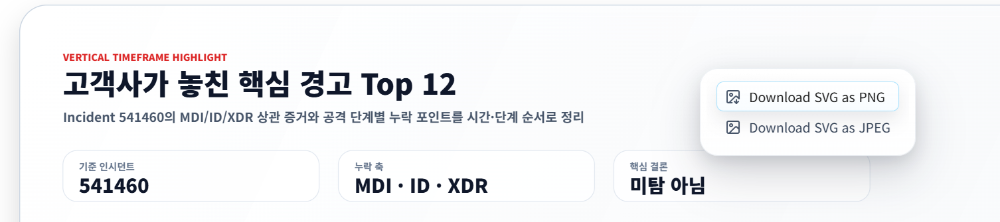
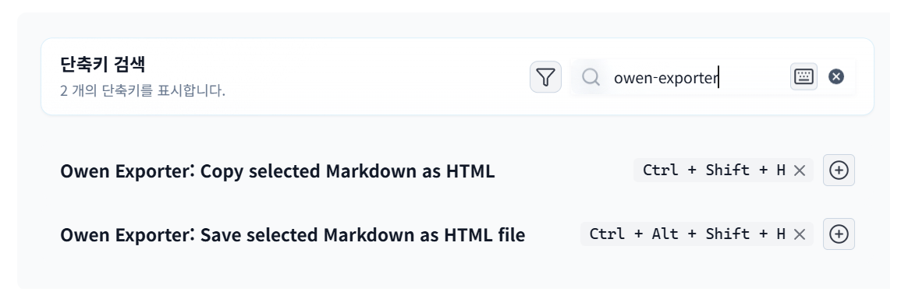

# Owen Exporter





Owen Exporter is an Obsidian plugin for two export workflows:

- Right-click an embedded SVG image and download it as PNG or JPEG.
- Select Markdown content, then copy it as rendered HTML or save it as an HTML file.

## Features

### SVG image export

In reading mode, right-click an embedded SVG image. Owen Exporter adds menu items to export the SVG as the default image format or the alternate format.

Settings include:

- Default output format: PNG or JPEG
- Save location: ask every time or save directly to a vault folder
- Image output folder for direct saves and batch exports
- Image filename template with tokens such as `{{name}}`, `{{note}}`, `{{folder}}`, `{{index}}`, `{{format}}`, `{{scale}}`, `{{date}}`, and `{{time}}`
- JPEG quality
- Rasterization scale for higher-resolution output
- Background color for JPEG or transparent SVGs
- Optional Markdown report files for SVG batch exports

Exports open a local save dialog so you can choose any PC folder. If the native save dialog is unavailable, the plugin falls back to the browser download flow.
If direct vault saving is enabled, exports are written to the configured image output folder instead.

Use the command palette action **Export all SVG embeds in current note** to export every SVG image embedded in the active note to the configured image output folder.
Use **Diagnose SVG embeds in current note** or the SVG context menu diagnostic action to check for external references, oversized output, or invalid background settings before exporting.
Use the SVG context menu preview action to review the source size, output size, filename, background, warnings, and PNG/JPEG export actions before saving.

### Markdown selection to HTML

In source mode, select Markdown text and right-click to access:

- Copy selection as HTML
- Copy selection through Obsidian-like, Portable, Clean HTML, or plain-text shortcuts
- Preview selection as HTML
- Save selection as HTML file
- Save current note as HTML file

The same actions are available as commands so users can assign or change hotkeys in Obsidian settings. Default hotkeys are:

- Copy selected Markdown as HTML: `Ctrl/Cmd+Shift+H`
- Save selected Markdown as HTML file: `Ctrl/Cmd+Shift+Alt+H`

Reading mode text selections are also supported through the browser selection context menu. In that mode the plugin copies or saves the selected rendered HTML fragment.

Table, code block, and callout exports include inline styles copied from the active Obsidian preview so the pasted or saved HTML keeps the Live Preview look more closely.
HTML style export can be set to Obsidian-like, Portable, or Clean HTML depending on whether you want stronger visual fidelity or lighter markup.

HTML settings include a vault output folder, a filename template, full document or fragment save mode, and a configurable document title template.
Profiles can switch quickly between Obsidian-like documents, portable documents, and clean fragments. Clipboard exports can write HTML plus plain text, HTML only, or plain text only.
Custom HTML profiles can save output folders, templates, save mode, style mode, clipboard format, document title, and HTML quality options.
Quality options include frontmatter exclusion, heading ID preservation, callout class preservation, and internal link conversion to Obsidian URIs.

By default, clipboard exports write both `text/html` and plain text, so pasting into rich editors keeps formatting while plain-text destinations receive readable text.

Recent export commands let you run the last export again, open the last exported file, reveal it in the system file manager, or copy its path.
The export history command shows recent saved files with open, reveal, and copy-path actions. Folder notes and linked notes can also be exported as HTML batches.

Workflow automation settings can open, reveal, or copy the path of saved files after export. SVG image exports saved to the vault can optionally insert a Markdown image link at the active cursor.
Settings can be exported to a JSON file in the vault and imported back from clipboard JSON.

## Development

```powershell
npm install
npm run test
npm run build
```

For local Obsidian testing, copy or symlink `manifest.json`, `main.js`, and optionally `styles.css` into a vault plugin folder such as:

```text
<vault>/.obsidian/plugins/owen-exporter/
```
